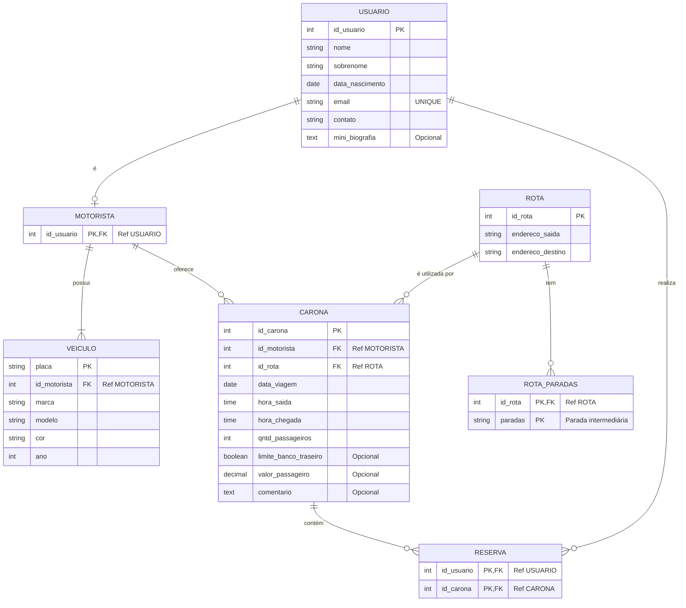

# Instituto Federal do Rio Grande do Norte - Campus Natal Central

**DIATINF - Diretoria Acadêmica de Gestão e Tecnologia da Informação**

**Curso:** Tecnologia em Análise e Desenvolvimento de Sistemas

**Disciplina:** Banco de Dados

**Professor:** Demóstenes Santos de Sena

**Discentes:** Alisson Bruno Dantas Felix (202501040034) e Patricia Cristina Bandeira de Melo (20251014040021)

## 1. Aplicação Web selecionada

**1.1. Nome:** BlaBlaCar

**1.2. Resumo:** "A BlaBlaCar é uma plataforma inovadora que conecta pessoas interessadas em compartilhar viagens de carro ou comprar passagens de ônibus para os mais variados destinos. Além de economizar tempo e dinheiro, a BlaBlaCar promove viagens mais sustentáveis e práticas."

**1.3. Link de acesso:** [BlaBlaCar](https://www.blablacar.com.br/)

## 2. Diagrama Relacional

## 3. Dicionário de Dados

**1. Tabela: USUARIO**

Armazena os dados cadastrais fundamentais de todos os usuários do sistema.

| Atributo          | Tipo de Dado | Chave  | Descrição                                 |
| :---------------- | :----------- | :----- | :---------------------------------------- |
| `id_usuario`      | INT          | PK     | Identificador único do usuário.           |
| `nome`            | VARCHAR(50)  | -      | Primeiro nome do usuário.                 |
| `sobrenome`       | VARCHAR(50)  | -      | Sobrenome do usuário.                     |
| `data_nascimento` | DATE         | -      | Data de nascimento.                       |
| `email`           | VARCHAR(100) | UNIQUE | Endereço de e-mail exclusivo para acesso. |
| `contato`         | VARCHAR(20)  | -      | Número de telefone celular.               |
| `mini_biografia`  | TEXT         | -      | Apresentação pessoal opcional do perfil.  |

**2. Tabela: MOTORISTA**

Tabela especializada para usuários que oferecem caronas (representa a herança de Usuário).

| Atributo     | Tipo de Dado | Chave  | Descrição                                                           |
| :----------- | :----------- | :----- | :------------------------------------------------------------------ |
| `id_usuario` | INT          | PK, FK | Identificador único do motorista (Referência `USUARIO.id_usuario`). |

**3. Tabela: VEICULO**

Registra os veículos associados e de propriedade dos motoristas.

| Atributo       | Tipo de Dado | Chave | Descrição                                                    |
| :------------- | :----------- | :---- | :----------------------------------------------------------- |
| `placa`        | VARCHAR(10)  | PK    | Placa de identificação do veículo.                           |
| `id_motorista` | INT          | FK    | Proprietário do veículo (Referência `MOTORISTA.id_usuario`). |
| `marca`        | VARCHAR(30)  | -     | Fabricante do veículo (ex: Fiat).                            |
| `modelo`       | VARCHAR(30)  | -     | Modelo do veículo (ex: Argo).                                |
| `cor`          | VARCHAR(20)  | -     | Cor predominante do veículo.                                 |
| `ano`          | INT          | -     | Ano de fabricação do automóvel.                              |

**4. Tabela: CARONA**

Entidade central do sistema, agrupando todas as informações da oferta de viagem, sem depender de tabelas transicionais desnecessárias.

| Atributo                | Tipo de Dado  | Chave | Descrição                                                                          |
| :---------------------- | :------------ | :---- | :--------------------------------------------------------------------------------- |
| `id_carona`             | INT           | PK    | Identificador único da oferta de carona.                                           |
| `id_motorista`          | INT           | FK    | Motorista condutor responsável (Referência `MOTORISTA.id_usuario`).                |
| `id_rota`               | INT           | FK    | Trajeto principal vinculado à viagem (Referência `ROTA.id_rota`).                  |
| `data_viagem`           | DATE          | -     | Dia previsto para a realização do deslocamento.                                    |
| `hora_saida`            | TIME          | -     | Horário programado de partida.                                                     |
| `hora_chegada`          | TIME          | -     | Horário estimado de término do trajeto.                                            |
| `qntd_passageiros`      | INT           | -     | Quantidade máxima de assentos ofertados.                                           |
| `limite_banco_traseiro` | BOOLEAN       | -     | Informa se limita a dois a quantidade de passageiros no banco traseiro (Opcional). |
| `valor_passageiro`      | DECIMAL(10,2) | -     | Preço unitário cobrado por assento/vaga (Opcional).                                |
| `comentario`            | TEXT          | -     | Regras ou observações opcionais estipuladas pelo motorista.                        |

**5. Tabela: RESERVA**

Tabela associativa que gerencia o vínculo N:M entre os passageiros e as caronas que eles ocupam.

| Atributo     | Tipo de Dado | Chave  | Descrição                                                          |
| :----------- | :----------- | :----- | :----------------------------------------------------------------- |
| `id_usuario` | INT          | PK, FK | Passageiro que solicita a vaga (Referência `USUARIO.id_usuario`).  |
| `id_carona`  | INT          | PK, FK | Carona onde a vaga foi solicitada (Referência `CARONA.id_carona`). |

**6. Tabela: ROTA**

Define os pontos geográficos principais (origem e destino) da viagem de forma isolada.

| Atributo           | Tipo de Dado | Chave | Descrição                                      |
| :----------------- | :----------- | :---- | :--------------------------------------------- |
| `id_rota`          | INT          | PK    | Identificador único da rota principal.         |
| `endereco_saida`   | VARCHAR(255) | -     | Logradouro ou cidade de origem inicial.        |
| `endereco_destino` | VARCHAR(255) | -     | Logradouro ou cidade final de término da rota. |

**7. Tabela: ROTA_PARADAS**

Entidade fraca (originada da quebra de um atributo multivalorado) listando os locais disponíveis para embarque intermediário.

| Atributo  | Tipo de Dado | Chave  | Descrição                                                              |
| :-------- | :----------- | :----- | :--------------------------------------------------------------------- |
| `id_rota` | INT          | PK, FK | Rota à qual a parada pertence (Referência `ROTA.id_rota`).             |
| `paradas` | VARCHAR(255) | PK     | Descrição ou cidade da parada intermediária (Compõe a chave primária). |
